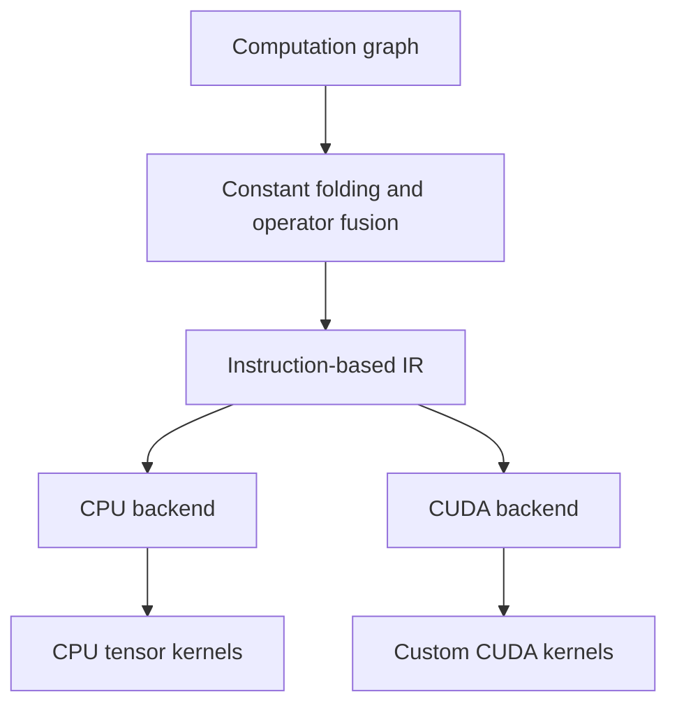

# MiniTensor

A small C++ tensor compiler/runtime that optimizes computational graphs,
lowers them to an instruction-based intermediate representation, and
executes supported workloads on CPU or NVIDIA CUDA backends.

MiniTensor is an educational systems project focused on graph
transformations, backend abstraction, custom kernels, and end-to-end
performance measurement.

## Architecture



The optimizer transforms the graph. Lowering emits reachable nodes in
dependency order, reuses shared nodes, and records an explicit output ID.
Backends interpret the IR using a table of tensor values.

## Features

- Float32 tensor operations.
- Constant folding for Add on constant inputs.
- MatMul + Add graph fusion.
- Dependency-ordered IR lowering with cycle detection and shared-node reuse.
- Runtime input replacement with shape validation.
- Common backend interface for CPU and CUDA execution.
- Custom CUDA ReLU and fused MatMul + Add kernels.
- Automatic GPU allocation cleanup through RAII.
- CPU/GPU correctness tests and repeated latency benchmarks.

## Supported operations

| Operation | CPU | CUDA |
|---|---|---|
| Input | Yes | Yes |
| Constant | Yes | Yes |
| MatMul | Yes | No |
| Add | Yes | No |
| FusedMatMulAdd | Yes | Yes |
| ReLU | Yes | Yes |

The CUDA backend executes the optimized MatMul + Add + ReLU workload.
Unsupported operations produce an error rather than silently falling
back to CPU execution.

## Example

The demo constructs:

```text
ReLU(MatMul(input, weight) + bias)
```

After optimization, its IR contains:

```text
0: Input
1: Constant
2: Constant
3: FusedMatMulAdd [0, 1, 2]
4: ReLU [3]
```

Both backends produce:

```text
19 23
43 51
```

The demo also shows constant folding reducing two Constants and an Add to
one Constant instruction.

## Build and test: CPU

Requirements:

- CMake 3.24 or newer.
- A C++17 compiler.

From the repository root:

```bash
cmake -S . -B build -DCMAKE_BUILD_TYPE=Release
cmake --build build --parallel 2
ctest --test-dir build --output-on-failure
./build/minitensor_demo
```

CUDA is disabled by default. The CPU build works independently of CUDA.

## Build and test: CUDA

Requirements:

- CMake 3.24 or newer.
- A compatible C++ compiler and CUDA toolkit.
- An NVIDIA GPU and compatible driver.

Configure on a machine where the GPU is visible:

```bash
cmake -S . -B build-cuda \
    -DCMAKE_BUILD_TYPE=Release \
    -DMINITENSOR_ENABLE_CUDA=ON \
    -DCMAKE_CUDA_ARCHITECTURES=native

cmake --build build-cuda --parallel 1
ctest --test-dir build-cuda --output-on-failure
./build-cuda/minitensor_demo
```

The CUDA build registers four CTest entries: CPU backend tests, the demo,
CUDA ReLU tests, and CUDA backend tests.

On Stanford FarmShare, run GPU programs inside a Slurm GPU allocation
and load the CUDA toolkit before configuring:

```bash
module load cuda/12.9.0
```

## Tests

The tests cover:

- CPU execution before and after optimization.
- Shared graph inputs and dependency-ordered lowering.
- Runtime input replacement and invalid-binding rejection.
- ReLU with mixed-sign inputs and multiple GPU blocks.
- Full optimized network execution on CPU and CUDA.
- Hand-calculated rectangular matrix multiplication.
- CPU/GPU agreement for rectangular fractional inputs.
- Invalid matrix dimensions and bias shapes.
- Rejection of unsupported CUDA operations.

Floating-point comparisons use tolerances where appropriate.

## Benchmarks

The benchmark compares complete execution of:

1. CPU: MatMul → Add → ReLU.
2. CPU: FusedMatMulAdd → ReLU.
3. CUDA: FusedMatMulAdd → ReLU.

Inputs are square float32 matrices with a full output-shaped bias.
Each path receives 3 warmups and 15 measured executions per size.
Execution order rotates between paths.

The table reports median end-to-end backend latency.

| Size | CPU unfused ms, R1 / R2 | CPU fused ms, R1 / R2 | CUDA ms, R1 / R2 | CUDA speedup, R1 / R2 |
|---|---:|---:|---:|---:|
| 128 | 0.346 / 0.349 | 0.335 / 0.341 | 0.348 / 0.360 | 1.00× / 0.97× |
| 256 | 2.228 / 2.335 | 2.194 / 2.304 | 0.663 / 0.970 | 3.36× / 2.41× |
| 512 | 15.961 / 16.876 | 17.120 / 18.743 | 2.352 / 3.363 | 6.78× / 5.02× |
| 1024 | 153.010 / 160.009 | 154.301 / 161.532 | 9.394 / 12.938 | 16.29× / 12.37× |

Speedup is relative to the custom single-threaded CPU unfused baseline,
not an optimized BLAS implementation.

Run 1 used an NVIDIA L40S and Intel Xeon Gold 6426Y on Stanford FarmShare,
with CUDA compiler 12.9.41 and GCC 13.3.0. Per-run environment records,
raw samples, and console output are included under `benchmarks/results/`.

The recorded measurements used a direct `nvcc -O3 -std=c++17` build.
CUDA timing includes allocations, host/device transfers, computation,
and synchronization. Graph construction and correctness comparisons
are outside the timed interval.

Across two runs, the 1024 × 1024 workload achieved 12.37–16.29× speedup.
Smaller workloads showed less benefit, and CPU fusion did not consistently
improve latency. Shared-system measurements varied between runs.

### Run a new benchmark

From the repository root after building CUDA:

```bash
mkdir -p benchmarks/results/local-run
cd benchmarks/results/local-run
../../../build-cuda/benchmark_backends 128 256 512 1024
```

The executable writes `benchmark_summary.csv` and
`benchmark_samples.csv` in the current directory. Each invocation
overwrites these files, so use a separate directory for each run.

See `benchmarks/README.md` for the original recorded build command.

## Current limitations

- Float32 only.
- Matrix multiplication is two-dimensional.
- Bias must match the full output shape; broadcasting is not implemented.
- CUDA fused matrix multiplication requires positive dimensions.
- Runtime replacement inputs must preserve the original shape.
- CUDA wrappers allocate and transfer data for each operation.
- Intermediate results return to CPU memory between CUDA operations.
- CUDA MatMul uses a straightforward kernel without shared-memory tiling.
- Lowering skips unreachable nodes but does not remove their graph objects.
- Graph nodes use non-owning pointers; callers must maintain their lifetime.
- No ONNX/PyTorch importer or automatic differentiation.

